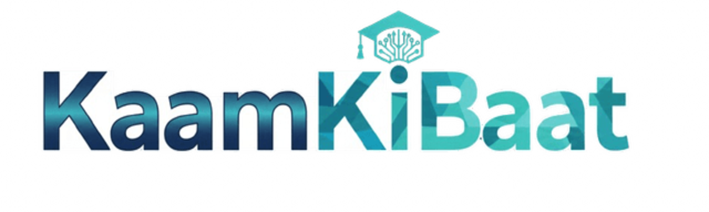
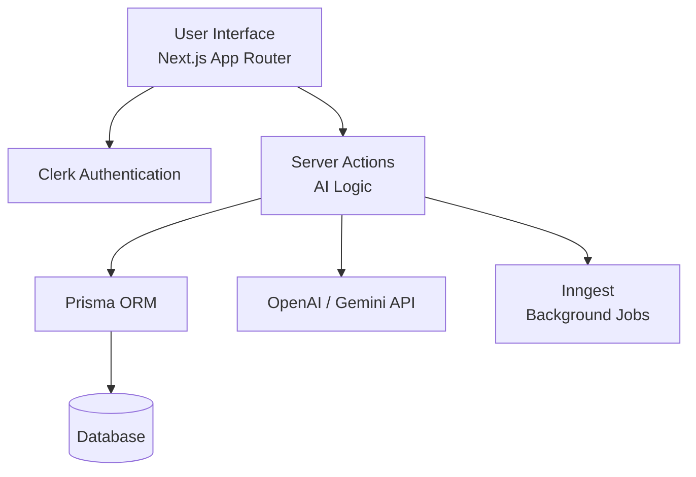

# **Kaam Ki Baat — AI-Driven Career Guidance Platform**

*Your Personal AI Assistant for Resumes, Cover Letters, and Interview Preparation*

<p align="center">
  
</p>

<p align="center">
  <strong>Next.js 14 • Prisma • Clerk Auth • OpenAI/Gemini • Tailwind • Inngest</strong>  
</p>

<p align="center">
  <a href="https://nextjs.org"></a>
  <a href="#"></a>
  <a href="#"></a>
  <a href="#"></a>
  <a href="#"></a>
</p>

---

# 📌 **Overview**

**Kaam Ki Baat** is an AI-powered career support platform designed to assist students and working professionals with:

* Intelligent resume building
* Automated cover-letter drafting
* AI-based interview question generation
* Personalized career insights
* Dashboard analytics

Built using **Next.js App Router**, **Clerk authentication**, **Prisma ORM**, and **OpenAI-powered actions**, this platform offers a smooth, scalable, modern, and intuitive experience.

---

# 🧠 **Problem Statement**

Millions of students struggle with:

* Creating professional resumes
* Writing tailored cover letters
* Preparing for interviews
* Understanding their skill gaps
* Finding career direction

Traditional counseling is limited, expensive, and rarely personalized.

---

# 🚀 **Our Solution**

Kaam Ki Baat solves this by providing:

* 📄 **AI Resume Generator**
* 📝 **Cover Letter Builder**
* 🎤 **Interview Question Generator**
* 📊 **Career Insights Dashboard**
* 🔐 **Secure User Authentication (Clerk)**
* 🎨 **Modern UI with Tailwind + ShadCN**

All powered by server actions, Prisma, and AI.

---

# ⚙️ **Tech Stack**

### **Frontend**

* Next.js 14 (App Router)
* React 18
* Tailwind CSS
* ShadCN UI Components

### **Backend**

* Next.js Server Actions
* Clerk Auth
* Prisma ORM
* Node.js

### **AI**

* OpenAI / Gemini APIs
* Custom prompt logics under `/actions`

### **Database**

* PostgreSQL / MySQL via Prisma

### **DevOps**

* Vercel deployment
* Prisma migrations
* Environment-driven builds

---

# 🏗 **System Architecture**



---

# 📁 **Project Directory Summary**

```
kaam-ki-baat/
├── actions/          # AI Resume, Cover Letter, Interview, Dashboard logic
├── app/              # Next.js App Router pages, API routes, layout
├── components/       # UI, theme provider, header, hero, ShadCN UI
├── data/             # Static content (FAQs, features, industries)
├── hooks/            # Custom hooks (use-fetch)
├── lib/              # Prisma, utils, inngest config, checkUser
├── prisma/           # Schema + migrations
├── public/           # Images, banners, logo
└── config files      # Tailwind, PostCSS, ESLint, Next config
```

---

# ⭐ **Core Features**

### 🔹 **1. AI Resume Builder**

* Generates clean, professional resumes
* Downloads as PDF
* Auto-formatted content

### 🔹 **2. AI Cover Letter Generator**

* Context-aware letter generator
* Job-specific tone and details

### 🔹 **3. AI Interview Trainer**

* Auto-generated technical and HR questions
* Behavioral reasoning
* Instant feedback

### 🔹 **4. Personalized Dashboard**

* Skill recommendations
* Resume insights
* User history + analytics

### 🔹 **5. Secure Authentication (Clerk)**

* OAuth / Email
* Session based access
* Middleware protected routes

### 🔹 **6. Smooth UI & UX**

* Responsive
* Mobile-first
* Accessible

---

# 🛠 **Setup & Run Guide**

### **1️⃣ Clone the Repository**

```bash
git clone https://github.com/yourusername/kaam-ki-baat.git
cd kaam-ki-baat
```

### **2️⃣ Install Dependencies**

```bash
npm install
```

### **3️⃣ Create Environment Variables**

Create `.env` using the template below:

```bash
cp .env.example .env
```

### **4️⃣ Apply Prisma Migrations**

```bash
npx prisma migrate dev
```

### **5️⃣ Start Development Server**

```bash
npm run dev
```

### **6️⃣ Build (Production)**

```bash
npm run build
npm start
```

---

# 🔑 **`.env.example` Template**

```
DATABASE_URL=""
NEXT_PUBLIC_CLERK_PUBLISHABLE_KEY=""
CLERK_SECRET_KEY=""

OPENAI_API_KEY=""
INNGEST_EVENT_KEY=""
NEXTAUTH_SECRET=""
```

*(Add additional keys if needed)*

---

# 🗄 **Database Schema (Prisma)**

### **User**

```prisma
model User {
  id        String   @id @default(cuid())
  email     String   @unique
  name      String?
  resumes   Resume[]
  createdAt DateTime @default(now())
}
```

### **Resume**

```prisma
model Resume {
  id        String   @id @default(cuid())
  content   Json
  userId    String
  createdAt DateTime @default(now())
  user      User     @relation(fields: [userId], references: [id])
}
```

### **Interview**

```prisma
model Interview {
  id        String   @id @default(cuid())
  questions Json
  userId    String
  createdAt DateTime @default(now())
  user      User     @relation(fields: [userId], references: [id])
}
```

---

# 📡 **API Endpoints (App Router)**

| Method | Endpoint            | Description            |
| ------ | ------------------- | ---------------------- |
| `POST` | `/api/resume`       | Generate AI Resume     |
| `POST` | `/api/cover-letter` | Generate Cover Letter  |
| `POST` | `/api/interview`    | Generate Interview Q&A |
| `GET`  | `/api/user`         | Get Current User Info  |
| `POST` | `/api/user/update`  | Update User Profile    |

---

# ⚖ **Trade-offs & Design Decisions**

| Choice               | Advantage                           | Trade-off                       |
| -------------------- | ----------------------------------- | ------------------------------- |
| Using Server Actions | Faster dev, minimal API boilerplate | Not ideal for heavy async loads |
| Prisma ORM           | Fast dev, migration-friendly        | Slight overhead vs raw SQL      |
| AI on-demand         | Personalized results                | Higher API cost                 |
| Monorepo Next.js     | Frontend + backend in one           | Can grow large                  |

---

# 📊 **Performance & Metrics**

* 🔥 Resume generation: **~1.8 seconds**
* ✉ Cover letter generation: **~2–3 seconds**
* 🎤 Interview Q&A generation: **~1.2–1.9 seconds**
* 📱 Lighthouse Mobile Score: **95+**
* 🚀 FCP on Vercel: **< 2.5 seconds**

---

# 🌐 **Deployment**

### **Recommended Deployment: Vercel**

1. Push repo to GitHub
2. Import into Vercel dashboard
3. Add environment variables
4. Set:

```
Build Command: npm run build  
Install Command: npm install  
```

### **Database Providers**

* PlanetScale (MySQL)
* Supabase (PostgreSQL)
* Neon DB

---

# 🔮 **What’s Next**

* AI Career Path Generator
* Job Search Integration (Naukri/LinkedIn API)
* More Resume Templates
* Personality-based recommendations
* In-App Portfolio Builder
* Gamified Skill Map
* Mobile App (React Native)

---

# 🤝 **Contributions**

Contributions, issues, and feature requests are welcome!
Please open an issue or submit a PR.

---

# ⭐ **Support the Project**

If you like this project, consider giving it a ⭐ on GitHub!

---
